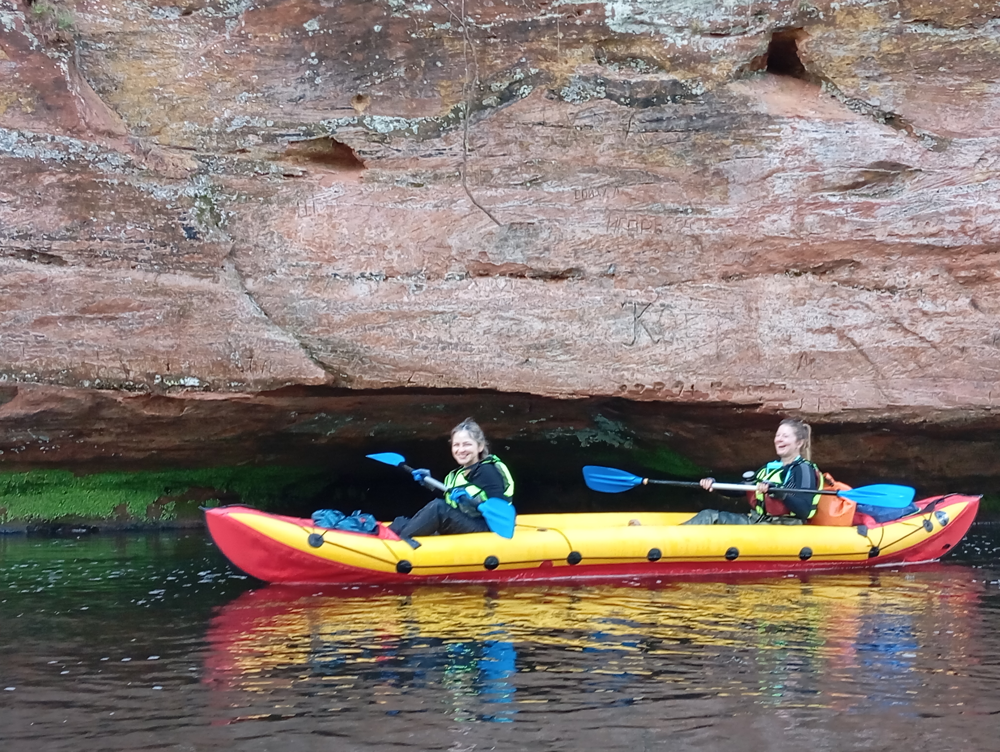

# Коротко обо мне

1. 41 год
2. Сменила профессию ветеринара на работу оператора станков с ЧПУ (числовым программным управлением). Заинтересовалась возможностями программирования.
3. Достоинства: _хорошее пространственное мышление, технический склад ума._
4. Образование:
  * среднее техническое образование в области машиностроения 
  * среднее медицинское образование
  * высшее ветеринарное образование
5. Люблю животных, компьютерные игры и исследование новых мест.
6. В данный момент изучаю __программирование на языке C++__.
   
   

   Контакты: 
   [olga_petrova8484@mail.ru](mailto:olga_petrova8484@mail.ru)